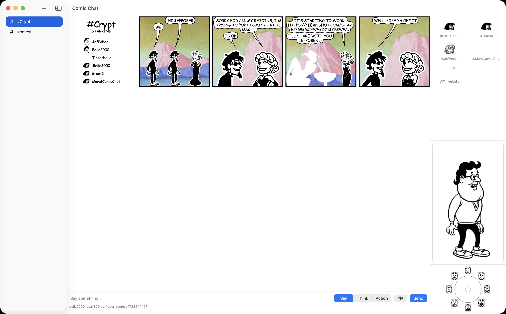

# Microsoft Comic Chat for macOS

A native macOS port of Microsoft Comic Chat 2.5, running the genuine 1998 layout/protocol engine under a SwiftUI shell.

[](#install) [](LICENSE)



## Features

- Live comic-strip rendering with the original 1998 layout engine (character placement, gesture/expression selection, balloon shape, panel composition)
- Multi-room chat with a rooms sidebar
- Emotion wheel plus "cooked" (auto-selected) poses for say/think/whisper/action
- Whisper box for private side-conversations
- Character and backdrop pickers, with a persona/profile editor
- Avatar announce and auto-download over plain HTTP, 1998-style, matching the wire protocol real Comic Chat clients still use
- Room list and room operations (join/part/topic/ops)
- Sounds in (received `/sound` and event sounds) and out (`#SOUND`, with a picker)
- Comic hit-testing: click a character to talk to them, hover for tooltips
- Save and reopen JSON transcripts; export to PNG and PDF; print
- Plain-text view as a toggle alongside the comic view
- Auto-reconnect with backoff and multi-room rejoin
- Notifications and Dock badge for new messages while away
- Favorites for quick reconnect to known rooms/servers
- Interop with the surviving community Comic Chat / MS Chat servers, including full IRCX

## Interop

This client speaks the real 1998 wire protocol, so it interoperates with actual Windows Comic Chat clients and with the small number of community servers still keeping MS Chat alive:

- **The Crypt** (`www.crypthome.com`) — OfficeIRC, full IRCX, the original MS Chat protocol. A small memorial server; be a good guest.
- **Comic Chat Network** (`comic.dedoky.com`) — community plain-IRC server. Nicknames are capped at 9 characters.
- **Koach.com** (`chat1.koach.com`) — long-running community server.

Credit to [Mermaid Elizabeth](https://mermeliz.com/) for maintaining the [Comic Chat server list](https://mermeliz.com/srvr_rms.htm) that keeps these servers discoverable.

## Install

**Download:** a notarized release build will be published on this repository's Releases page *(placeholder — no release yet)*.

**Build from source:**

Requires Xcode 16 or later (Xcode 26 also supported).

```sh
xcodebuild -project macos/ComicChat/ComicChat.xcodeproj -scheme ComicChat build
```

Run the engine and protocol test suite (headless, no GUI required):

```sh
cd macos/ComicChatKit && swift test
```

## Architecture

The port uses a "shim-and-lift" approach: the original C++ engine — comic layout, avatar/art rendering, and the IRC/MS Chat protocol handling, lifted from `v2.5-beta-1-modern/` largely unmodified — is compiled as a library against a small MFC-compatibility shim rather than reimplemented. A single C bridge header, `comicchat.h`, is the *only* interface visible to Swift; no C++ or Win32 types cross it. This lives in a SwiftPM package (`macos/ComicChatKit`) so the engine and protocol logic can be tested headlessly with `swift test`, independent of the GUI. A SwiftUI app (`macos/ComicChat`) sits on top and talks to the engine only through that bridge. Networking is bytes-in/events-out: raw bytes go to the engine's parser, typed events come back out, and the app's IRC transport preserves CP-1252 wire fidelity so annotations exchanged with real Windows Comic Chat clients decode correctly. The transcript itself is the event log — reflowing the comic view (e.g. on resize or panels-per-row changes) replays that log rather than mutating rendered state.

See [`docs/superpowers/specs/2026-07-17-macos-port-design.md`](docs/superpowers/specs/2026-07-17-macos-port-design.md) for the full design writeup.

## Provenance & License

Comic Chat was originally a Microsoft Research project created by David "DJ" Kurlander; see the [Kurlander, Skelly, and Salesin SIGGRAPH '96 paper](https://dl.acm.org/doi/10.1145/237170.237260), "Comic Chat," for the original design. This repository is a fork of [Microsoft's open-source release](https://github.com/microsoft/comic-chat) of the Comic Chat source code. The license carried at [`/LICENSE`](LICENSE) (MIT) applies to the whole tree, including the code in `macos/`. See [`CREDITS.md`](CREDITS.md) for full attribution, including the original comic-art character artists.

This project is not affiliated with or endorsed by Microsoft.

## Status

This is a working, feature-complete port of the Comic Chat 2.5 client, with a few deliberate exceptions: no DCC file transfer, no OLE/COM embedding, no NetMeeting integration, and no reading/writing the original `.ccc` conversation format. Everything else — connecting, chatting, the comic strip itself — works against real servers today.

Microsoft's original upstream README, describing the archived source releases (`v1.0` through `v2.5-beta-1`) this port is built from, is preserved at [`docs/README-upstream.md`](docs/README-upstream.md).
